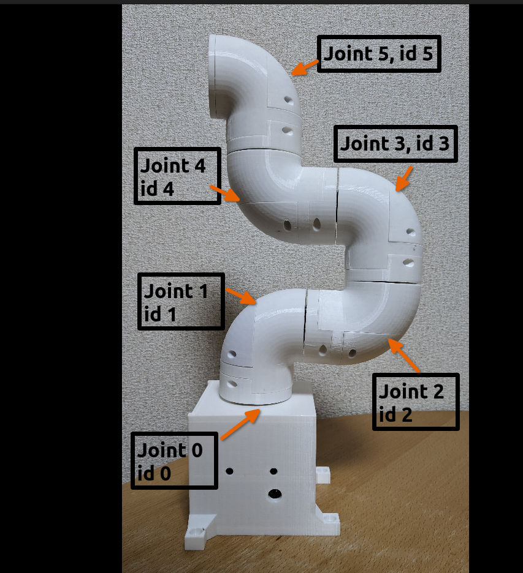
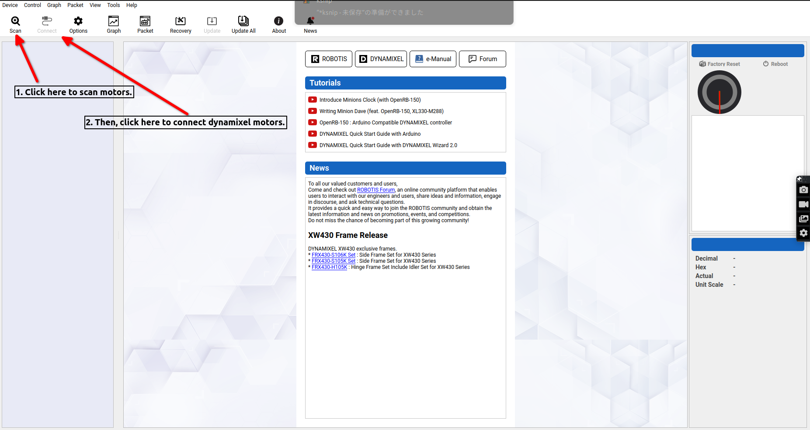
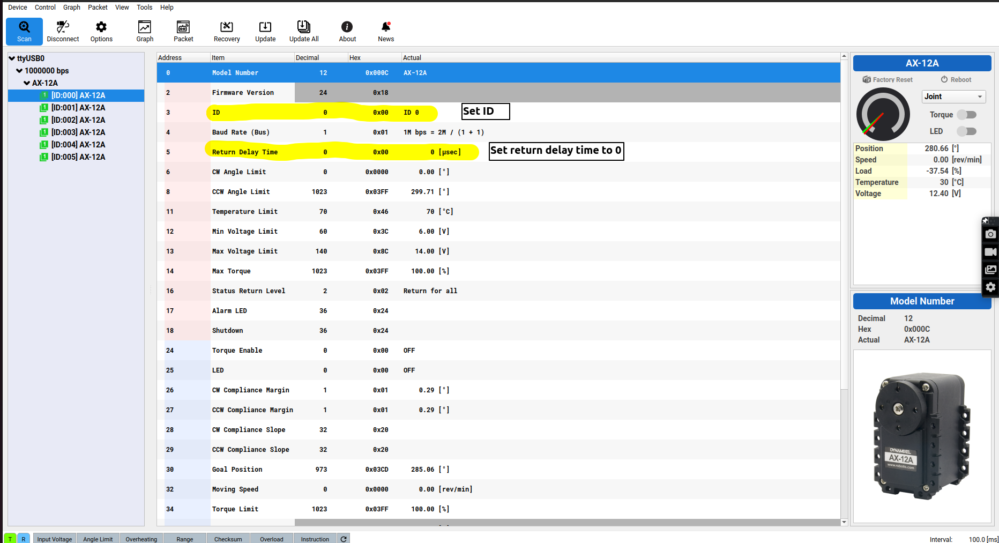

# wormy_arm
3D-printed robot arm named "Wormy Arm".

## Note
I designed and created my own robot for my education from mechanical design to ros-based software.
Please feel free to reproduce your own wormy arm with 3D printers and actuate it using this ros-based repository under Apache 2.0 license.

I am also adding some notes about the process of development [here](/src/wormy_arm/docs/development_notes) since it would be useful for someone learning ROS and robotics like me. 

If you would like to create "wormy-arm" please follow the [here](#setup).

Have a fun!

## Setup
### 1. Hardware setup
#### 1.1 3D-printed parts

Please download parts from this [link](https://cad.onshape.com/documents/3f8fd3cb66199d54e5d8a8ef/w/dd6d2618a85894306c9569e8/e/543bf18749a4cd6580b86a53?renderMode=0&uiState=63ea472403b3c042dfd15e70).

It has multiple parts but you are supposed to assemble a robot named "wormy_short", which has 6 degree of freedom.
In short, the parts you should print out are the followings:

| Module | Part                   | Number |
| ------ | ---------------------- | ------ |
| link_0 | base_mount_motor       | x1     |
|        | base_mount_raspberrypi | x1     |
|        | base_case              | x1     |
|        | base_cover             | x1     |
| link_1 | motor_mount_a1         | x1     |
|        | motor_mount_b          | x1     |
|        | joint_connector_a      | x1     |
| link_2 | motor_mount_a1         | x1     |
|        | motor_mount_b          | x1     |
|        | joint_connector_a      | x1     |
| link_3 | motor_mount_a1         | x1     |
|        | motor_mount_b          | x1     |
|        | joint_connector_a      | x1     |
| link_4 | motor_mount_a1         | x1     |
|        | motor_mount_b          | x1     |
|        | joint_connector_a      | x1     |
| link_5 | motor_mount_a1         | x1     |
|        | motor_mount_b          | x1     |
|        | joint_connector_a      | x1     |
|        | joint_connector_a2     | x1     |

#### 1.2 Non 3D-printed parts
- Motors and the accessories.
  - [dynamixel AX-12a](https://emanual.robotis.com/docs/en/dxl/ax/ax-12a/) x 6.
  - [SMPS2Dynamixel](https://e-shop.robotis.co.jp/product.php?id=175) x 1.
  - [U2D2 RS485](https://emanual.robotis.com/docs/en/parts/interface/u2d2/) x 1.

- Bolts
  - M2-14mm x 6
  - M2-8mm x 24
  - (M3-16mm x 8)
  - M3-10mm x 30 
- Nuts
  - uxcell M3-5mm-5mm x 38 ([link](https://www.amazon.co.jp/dp/B019I147QE?tag=gekiyasuco089-22&linkCode=ogi&th=1&psc=1))

- Bush parts
I used 6 [these bushes](https://www.monotaro.com/p/0045/6477/) to support rotating axis of which outer diameter is 28 mm and inner diameter is 25 mm.

Then, you are ready to assemble them to finish the hardware setup!

#### Notes
The robot had been firstly designed like [mycobot](https://www.elephantrobotics.com/en/mycobot-en/), however, I found that AX-12a did not have a enough torque to control joint_1, which is a joint betwenn link_0 and link_1. In the end, I shorten the first design to the current one by changing the assembling (^^;).

The good point is that my mechanical design has such a flexibility to change its design, so please feel free to design your own robot by changing the current assembling.

### 2. Assemble and motor setup
#### 2.1 Connect cables
#### 2.2 Dynamixel motor setup
- Install dynamixel wizard 2
  Please refer [here](https://emanual.robotis.com/docs/en/software/dynamixel/dynamixel_wizard2/).

- Enable your device
Check your device name by
~~~
ls /dev/
~~~
comparing before and after plugging your usb cable.
It is, e.g., ttyUSB0
After clarifying your device name, enable the device with

~~~
sudo chmod 666 /dev/YOUR_DEVICE
~~~
Again, YOUR_DEVICE is, e.g., ttyUSB0.

- Change ID and Return Time Delay

Change dynamixel motor ID by using dynamixel wizard 2.
The default ID is 0 and the motors collide each other if you try to change all motors at once.
Therefore, please plug one by one and change the id of dynamixel motors.

After plugging a dynamixel motor, you have to setup
1. ID
2. Return Time Delay

IDs of dynamixel motors should be 0 to 5 corresponding to joint_0 to joint_5.

The joints map is shown here.

Besides, you need to change "Return Time Delay" to 0.
How to use dynamixel wizards are shown in the following images:

- Play with dynamixel wizard
Please activate dynamixel motors before assembling to make sure.
#### 2.3 Assemble mechanical parts

### 3. Software setup
This repository is supposed to use a [dockerfile](https://github.com/RyotaYoneyama/ros-docker.git) to activate dynamixel motors.
#### 3.1 Docker
~~~
git clone https://github.com/RyotaYoneyama/ros-docker.git
docker build -f Ubuntu/melodic/Dockerfile -t ubuntu-melodic-dynamixel  Ubuntu/melodic/ 
~~~

The structure of the repository is 
<pre>
├── LICENSE
├── README.md
├── Ubuntu
│   └── melodic
│       ├── Dockerfile
│       ├── README.md
│       ├── devicecontrol.sh
│       ├── entrypoint.sh
│       └── usercontrol.sh
└── src
You are supposed to clone ros packages under ros-docker/src.
</pre>

#### 3.2 Clone repository
~~~
cd ros-docker/src
git clone --recursive https://github.com/RyotaYoneyama/wormy_arm.git
~~~

#### 3.3 Run docker and usb latency setup
- Setup your device and display.

~~~
sudo chmod 666 /dev/YOUR_DEVICE
xhost +
~~~
YOUR_DEVICE is your usb device, e.g, ttyUSB0.

- Run docker container
~~~
docker run -it --rm --privileged --net host --ipc host \
        -v /tmp/.X11-unix:/tmp/.X11-unix -e DISPLAY=$DISPLAY \
        -e LOCAL_UID=`id -u $USER` -e LOCAL_GID=`id -g $USER` \
        -v $PWD/src:/home/ubuntu/catkin_ws/src/ \
        -e LOCAL_DEVICE=YOUR_DEVICE \
        --device /dev/YOUR_DEVICE:/dev/YOUR_DEVICE \
        ubuntu-melodic-dynamixel:latest bash
~~~
YOUR_DEVICE is your usb device, e.g, ttyUSB0.

Now, you are in the container.

#### 3.4 catkin build
~~~
catkin build
source devel/setup.bash
~~~
#### 3.4 Launch bring up !
Please modify port_name in src/wormy_arm/wormy_arm_control/config/dynamixel.yaml, then execute the following command:
~~~
roslaunch wormy_worm_bringup wormy_short_bringup.launch
~~~

You will see Rviz gui with moveit! and the motors are activated.

## Description
You can refer the description of the robot [here](/src/wormy_arm/docs/description) soon.

## Development notes
I am adding some notes about the process of development [here](/src/wormy_arm/docs/development_notes)

They would be useful to refer if you wonder how to start mechanical design, how to setup ros_control and moveit.

## Acknowledgement
I referred the following blogs or used OSS tools a lot to build my own robot.
I could not develop my robot and learn a lot without even one of them.
Thanks !

### Tools, libraries
- Onshape
- ROS
  - moveit!
  - ros_control
- [Onshape to robot](https://github.com/Rhoban/onshape-to-robot.git)
(A great tool to convert an assemble file of onshape to an URDF file.)
- [Dynamixel wizard 2](https://emanual.robotis.com/docs/en/software/dynamixel/dynamixel_wizard2/)

### Referred repository
- [Minimum ros control](https://github.com/yoneken/minimum_ros_control)
- [crane_plus](https://github.com/rt-net/crane_plus.git)
- [crane_x7_ros](https://github.com/rt-net/crane_x7_ros.git)

### Blogs
- [RT blogs, JP]( https://rt-net.jp/humanoid/archives/3415)
- [myCobotを自作してみた話, JP
]( https://rt-net.jp/humanoid/archives/3415)
- [ros_control, JP](https://qiita.com/takijo/items/c10b874881099c4a6635)
- [Insert nuts, JP](https://burariweb.info/gadget/3d-printer/3dprinted-parts-heat-insert.html)
- [moveit! tutorials](http://docs.ros.org/en/melodic/api/moveit_tutorials/html/index.html)

